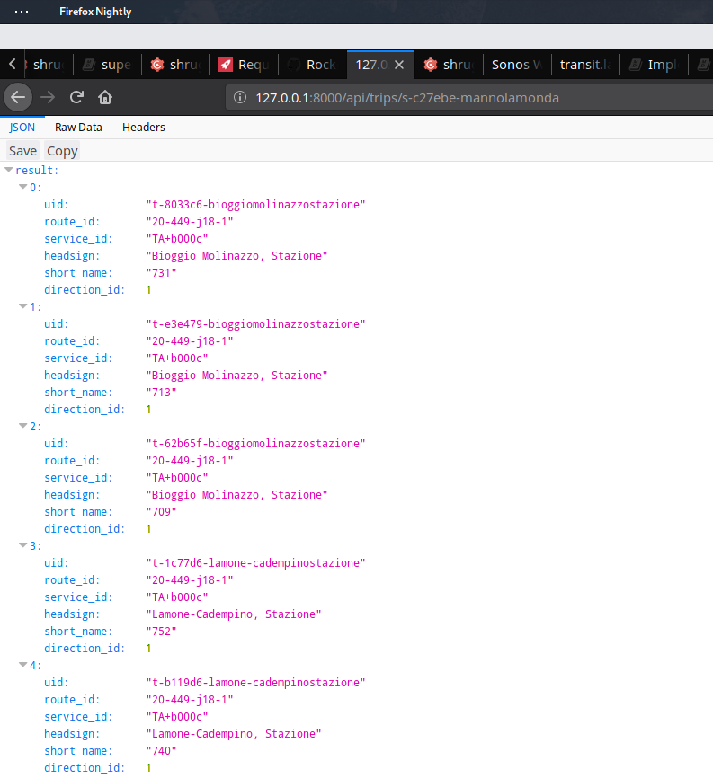
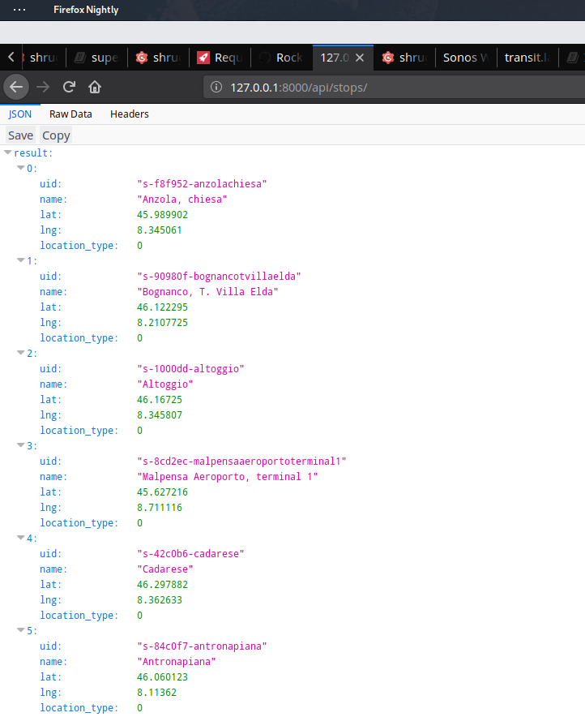
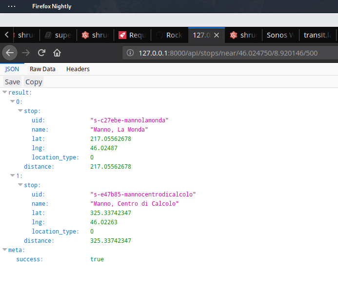

# GTFS Server

## Instructions
```bash
mkdir resources/gtfs/sbb/
wget https://opentransportdata.swiss/en/dataset/timetable-2018-gtfs/permalink -O resources/gtfs/sbb/gtfs.zip
cd resources/gtfs/sbb/
unzip gtfs.zip
```

## Objects

### Stop
A `Stop` represents a physical public transporation stop. 
It may be a Bus Stop, a Train Station, ...

#### Fields
| Field Name | Description |
| ---------- | ----------- |
| uid        | Represents the unique identifier for this stop (`s-[a-f0-9]-[a-z0-9]`),   for example `s-c27ebe-mannolamonda` |
| name       | The name of this stop |
| lat        | Latitude |
| lng        | Longitude |

### Trip
| Field Name | Description |
| ---------- | ----------- |
| uid        | Represents the unique identifier for this stop (`t-[a-f0-9]-[a-z0-9]`),   for example `t-8033c6-bioggiomolinazzostazione` |
| service_id | The Service ID |
| headsign   | This is the heasign for the trip, as it would appear on an LED panel |
| short_name | A short name for the trip. For example `713` (aka Bus Number / Line Number) |
| direction_id | TODO: Describe this |

## Endpoints

### /api/stops
Returns a list of [Stop](#stop)s

#### /api/stops/near/<latitude>/<longitude>/<range>
Returns a list of [Stop](#stop)s that are within `<range>` meters from the provided `<latitude>` and `<longitude>`

### /api/trips
Returns a list of [Trip](#trip)s

#### /api/trips/<stop_id>
Returns the available [Trip](#trip)s at the provided [Stop](#stop)

## Screenshots

### /api/trips/<stop_id>

### /api/stops/

### /api/stops/near/<latitude>/<longitude>/<range>
